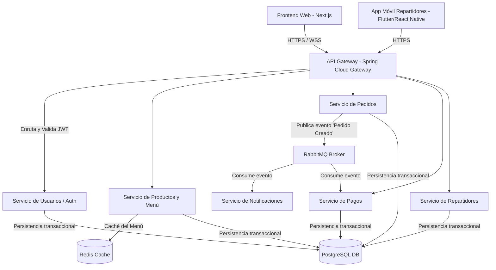
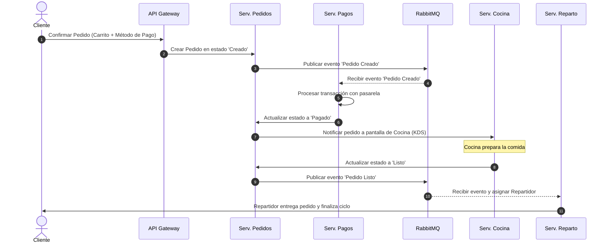

# Arquitectura de Software - Restaurate
*Especificación Técnica de la Plataforma de Gestión de Restaurantes y Pedidos*

---

## 1. Visión General de la Arquitectura

La plataforma **Restaurate** está diseñada bajo un enfoque de **microservicios desacoplados**, permitiendo que cada componente funcional se desarrolle, despliegue y escale de forma independiente. Esta arquitectura garantiza una alta tolerancia a fallos, facilidad de mantenimiento y escalabilidad horizontal durante picos de demanda (por ejemplo, en horas de almuerzo o cena).

### Principios de Diseño:
* **Escalabilidad Horizontal:** Los servicios críticos (Pedidos, Productos) pueden replicarse en múltiples contenedores.
* **Alta Disponibilidad:** Redundancia a nivel de base de datos y balanceadores de carga para evitar puntos únicos de fallo.
* **Seguridad Robusta:** Autenticación y autorización centralizadas mediante JSON Web Tokens (JWT) y OAuth2.
* **Procesamiento Asíncrono:** Uso de colas de mensajería para tareas no bloqueantes, como el envío de notificaciones y la facturación.

---

## 2. Diagrama de Arquitectura y Componentes

El siguiente diagrama detalla la interacción entre las aplicaciones cliente, la capa de entrada (API Gateway), los microservicios de negocio y el almacenamiento de datos:

### Componentes Principales:
* **Frontend Web (Next.js + React):** Aplicación de cara al cliente para pedidos y panel administrativo de gestión.
* **Aplicación Móvil para Repartidores:** Interfaz liviana para que los repartidores reciban notificaciones de entrega y actualicen estados con su geolocalización.
* **API Gateway (Spring Cloud Gateway / Nginx):** Punto único de entrada al sistema. Se encarga del enrutamiento dinámico, limitación de peticiones (rate limiting) y terminación SSL.
* **Servicio de Usuarios (Auth Service):** Gestiona el registro, perfiles, credenciales e inicio de sesión seguro, emitiendo tokens JWT firmados.
* **Servicio de Productos (Menu Service):** Administra el menú digital, categorías de platos, ingredientes, stock y carga de imágenes.
* **Servicio de Pedidos (Order Service):** Contiene la lógica del carrito, cálculo de totales, impuestos, creación de órdenes y ciclo de vida de los estados del pedido.
* **Servicio de Pagos (Payment Service):** Se integra con pasarelas de pago de terceros (como Stripe, PayPal o MercadoPago) y registra los estados de las transacciones.
* **Servicio de Repartidores (Delivery Service):** Gestiona la disponibilidad de los repartidores y la asignación óptima de pedidos listos basándose en la distancia.
* **Servicio de Notificaciones:** Encargado de enviar correos electrónicos de confirmación, SMS o notificaciones push en tiempo real a clientes y repartidores.

---

## 3. Flujo de Datos Principal (Ciclo de un Pedido)

1. **Autenticación e Inicio:** El cliente inicia sesión, consulta el menú (cargado desde Redis para mayor velocidad) y agrega platos al carrito.
2. **Checkout:** El cliente confirma la orden seleccionando dirección y método de pago. La petición pasa por el API Gateway donde se valida el token JWT.
3. **Registro de Pedido:** El *Servicio de Pedidos* valida el stock, calcula el monto total y registra el pedido con el estado **"Creado"**.
4. **Procesamiento de Pago:** El *Servicio de Pagos* procesa la transacción de forma asíncrona. Si el pago es exitoso, publica el evento en **RabbitMQ** y actualiza el estado del pedido a **"Pagado"**.
5. **Preparación en Cocina:** El panel de la cocina (KDS) recibe el pedido en tiempo real mediante WebSockets. El personal de cocina inicia la preparación y marca el pedido como **"Listo para Entrega"** al finalizar.
6. **Asignación de Reparto:** El *Servicio de Repartidores* detecta el pedido listo y asigna automáticamente al repartidor idóneo basándose en cercanía y capacidad de carga activa.
7. **Entrega y Cierre:** El repartidor entrega los alimentos y marca el pedido como **"Entregado"** en su aplicación. El sistema suma los puntos correspondientes al cliente registrado y le habilita la opción de calificar el servicio.

---

## 4. Tecnologías y Herramientas Utilizadas

| Tecnología | Rol en la Plataforma | Justificación |
| :--- | :--- | :--- |
| **Java + Spring Boot** | Backend (Microservicios) | Framework robusto, óptimo para arquitecturas empresariales y microservicios escalables. |
| **Next.js + React** | Frontend Web | Carga rápida (SSR/SSG), excelente SEO y desarrollo modular de la UI. |
| **PostgreSQL** | Base de Datos Relacional | Garantiza integridad referencial (ACID) ideal para transacciones financieras y pedidos. |
| **Hibernate (JPA)** | ORM (Mapeo Objeto-Relacional) | Facilita la interacción entre Spring Boot y PostgreSQL, reduciendo el código SQL manual. |
| **Redis** | Base de datos en caché | Almacenamiento en memoria de sesiones de usuario y menú digital para reducir latencia. |
| **RabbitMQ** | Broker de Mensajería | Facilita la comunicación asíncrona e intercambio de eventos entre microservicios de manera segura. |
| **Docker & Kubernetes** | Contenedores y Orquestación | Empaquetamiento estándar y escalabilidad automática de servicios en entornos de producción. |
| **Nginx** | Servidor Web y Proxy Inverso | Balanceo de carga eficiente, seguridad y manejo de tráfico estático en la capa externa. |
