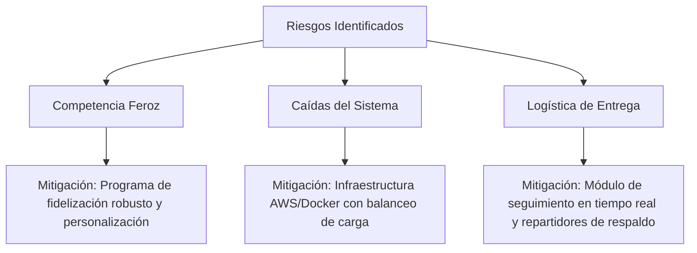

# Plan de Negocios - Restaurate
*Plataforma Digital de Pedidos en Línea y Gestión Gastronómica*

---

## 1. Resumen Ejecutivo

**Restaurate** es una solución tecnológica integral diseñada para digitalizar la experiencia de consumo en restaurantes. La plataforma permite a los clientes realizar pedidos de forma rápida y segura a través de aplicaciones web y móviles para tres modalidades de consumo:
* **Consumo en local:** Pedidos desde la mesa mediante códigos QR.
* **Retiro en tienda (Pick-up):** Pedidos programados para llevar.
* **Entrega a domicilio (Delivery):** Distribución gestionada por repartidores integrados o propios del restaurante.

Para los administradores del restaurante, **Restaurate** ofrece un panel centralizado de control que unifica la gestión del menú, el procesamiento de pedidos, la automatización del marketing y analíticas de ventas en tiempo real, optimizando la eficiencia operativa y maximizando la rentabilidad.

---

## 2. Análisis de Mercado y Público Objetivo

### 2.1. Público Objetivo (Target)
* **Clientes Finales:** 
  * Personas con poco tiempo libre (trabajadores y estudiantes) que buscan comodidad y rapidez.
  * Familias y grupos que prefieren planificar y pagar sus comidas de forma digital.
  * Clientes corporativos que requieren pedidos recurrentes o de gran volumen.
* **Restaurantes y Comercios Gastronómicos:**
  * Establecimientos medianos y grandes que desean independizarse de las altas comisiones de plataformas de delivery de terceros.
  * Negocios gastronómicos tradicionales que buscan iniciar su transformación digital.

### 2.2. Problemas del Mercado vs. Soluciones de Restaurate

| Problema Identificado | Solución de Restaurate |
| :--- | :--- |
| **Tiempos de espera excesivos** en caja o mesa para ordenar y pagar. | Autogestión mediante pedidos en línea y pagos digitales rápidos. |
| **Errores en la toma de pedidos** por vía telefónica o manual. | Interfaz digital clara que envía la orden directamente a la cocina sin intermediarios. |
| **Bajo control de datos de clientes** en plataformas de delivery tradicionales. | Base de datos propia que permite al restaurante fidelizar a sus clientes directamente. |
| **Falta de visibilidad** de promociones y actualización lenta del menú físico. | Menú digital interactivo actualizable al instante con notificaciones de ofertas. |

---

## 3. Modelo de Monetización

La plataforma opera bajo un modelo de suscripción mensual estructurado en tres niveles para adaptarse al tamaño y necesidades de cada negocio:

| Plan | Tarifa Mensual | Beneficios y Características |
| :--- | :--- | :--- |
| **Plan Básico** | Gratis | <ul><li>Acceso al menú digital.</li><li>Registro básico de clientes.</li><li>Gestión de promociones estándar.</li><li>Hasta 100 pedidos mensuales.</li></ul> |
| **Plan Pro** | $29.99 / mes | <ul><li>Pedidos ilimitados.</li><li>Integración con pasarelas de pago.</li><li>Módulo de repartidores propio.</li><li>Estadísticas de ventas básicas.</li><li>Soporte técnico por correo.</li></ul> |
| **Plan Premium (Studio)** | $59.99 / mes | <ul><li>Todo lo del Plan Pro.</li><li>Programa de fidelización de clientes (puntos y recompensas).</li><li>Analítica avanzada con Inteligencia Artificial para predicción de demanda.</li><li>Múltiples sucursales y roles administrativos.</li><li>Soporte 24/7 con ejecutivo asignado.</li></ul> |

---

## 4. Estrategia de Marketing y Ventas

Para asegurar el crecimiento sostenido y la retención de usuarios en **Restaurate**, se implementarán las siguientes estrategias:

* **Adquisición de Usuarios:**
  * **Campañas de Performance:** Anuncios segmentados geográficamente en Instagram, Facebook y TikTok orientados a amantes de la comida local.
  * **Marketing de Contenidos e Influencers:** Colaboraciones con creadores gastronómicos locales para probar el uso de la aplicación en el restaurante.
  * **Estrategia O2O (Online-to-Offline):** Uso de material POP (códigos QR en las mesas, manteles y displays) para incentivar la descarga de la app dentro del local mediante descuentos en la primera orden.
* **Estrategias de Retención:**
  * **Programa de Puntos:** Acumulación de puntos por cada compra canjeables por productos gratis o descuentos exclusivos.
  * **Campañas de Notificaciones Push:** Ofertas personalizadas basadas en el historial de pedidos y gustos del cliente (ej. *"¡Tu pizza favorita tiene un 20% de descuento hoy!"*).
  * **Cupones de Cumpleaños:** Incentivos especiales para fechas especiales de los clientes registrados.

---

## 5. Análisis de Riesgos y Mitigación

### 5.1. Competencia en el Sector Gastronómico
* **Riesgo:** Alta penetración de grandes agregadores (como Rappi, Uber Eats) y otros sitemas de software para restaurantes.
* **Mitigación:** Ofrecer comisiones del 0% por venta a los restaurantes en sus planes de suscripción, dándoles control total sobre sus ingresos y los datos de sus clientes.

### 5.2. Fallas en la Infraestructura o Retrasos de Software
* **Riesgo:** Pérdida de pedidos y frustración del cliente por inactividad de los servidores en horas pico de comida.
* **Mitigación:** Arquitectura en la nube altamente redundante y escalable (Docker/Kubernetes), con sistemas de respaldo locales capaces de guardar el estado de las órdenes de manera temporal ante microcortes de red.

### 5.3. Logística y Desempeño de Repartidores
* **Riesgo:** Quejas por pedidos fríos, demoras o mala manipulación del alimento.
* **Mitigación:** Módulo integrado para el control de tiempos de entrega, capacitación para repartidores y algoritmo de asignación automática al repartidor más cercano al local.
